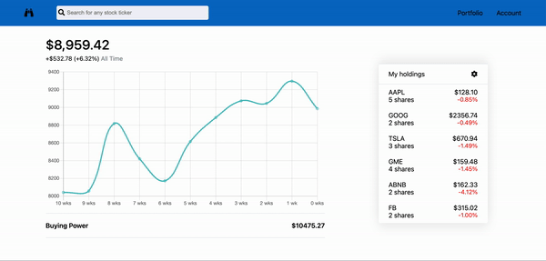

<h1 align="center">Tech-watch</h1>

<p align="center">See site hosted on heroku
<br><a href="https://tech-watch.herokuapp.com/">Tech-watch</a></br></p>
&nbsp

## Summary
Tech-watch is a web application inspired by Robinhood using React/Redux for the frontend and python on the backend.  Tech-watch allows users to buy and sell stocks and to track the performance of their portfolio.  All stock prices and information are accurate and up-to-date. A user can search any stock in the US market and determine if it is a good buy. (Please see end for set-up)

<p>&nbsp;</p>

<p align="center">
  
</p>


## Overall Structure

---

### Backend

The app is built using Python and SQLAlchemy on the backend with a postgreSQL database.  All routes are RESTful and done using a JSON API

### Frontend

The font end is built using React.js and Redux.

### Libraries
Readly uses:
 - [React.js](https://reactjs.org/)
 - [Redux](https://redux.js.org/)
 - [BCrypt](https://pypi.org/project/bcrypt/) for authorization
 - [Finnhub](https://finnhub.io/) for up-to-date stock data
 - [Python3](https://www.python.org/) for all backend routes
 - [SQLAlchemy](https://www.sqlalchemy.org/) for queries
 - [PostgreSQL](https://www.postgresql.org/) for data storage


## Wiki Documentation

---

- [Front End Routes](https://github.com/sam-hearst/tech-watch/wiki/Frontend-Routes)
- [Database Schema](https://github.com/sam-hearst/tech-watch/wiki/Database-Schema)
- [MVP Features](https://github.com/sam-hearst/tech-watch/wiki/Feature-List-(MVPs))

<p>&nbsp;</p>


## Key Technical Features

 ---


### Ability to search any stock

A key feature was the implementation of the Finnhub API. When adding a user queries for a stock, the api route first queries the database to see if the stock is seeded.  If the stock isn't seeded, then the Finnhub API is queried and relevant information pull from there.  In the gif, Snapchat is not in the database.

<p>&nbsp;</p>

<p align="center">
  
</p>


```python
@stock_routes.route("/info/<ticker>")
def get_stock(ticker):

    stock = Stock.query.filter_by(stock_ticker=ticker).first()

    if not stock:
        # if the stock is not seeded, then use API to get the information
        finnhub_client = finnhub.Client(os.environ.get("FINNHUB_API_KEY"))

        company_profile = finnhub_client.company_profile(ticker.upper())
```


## Obstacles

---

### Creating portfolio graph

One of the major hurdles in the project was creating the portfolio graph.  A lot of historical stock tick data had to pulled from the API and then aggregated to display how one's portfolio has performed over time.  The data also had to include the number of shares of each stock that a user owned. I created a helper function to do all the data manipulation and used the react-chartjs-2 node package to display the data.  As seen below, I first queried the holdings for a specfic user, and then converted it to the right formatting.  Finally called get_data_pts on the holding tickers and the number of shares.  I then passed that data to the frontend and into the chart.

```python
@holding_routes.route('/<int:user_id>')
@login_required
def holding_ticks(user_id):
    holdings_info = Stock_Details.query.filter(
        Stock_Details.user_id == user_id).all()

    holdings_info_converted = [holding_info.to_dict()
                               for holding_info in holdings_info]
    holdings = [holding_info.stock.to_dict() for holding_info in holdings_info]

    converted_holdings = convert_holdings(holdings, holdings_info_converted)

    tickers = [converted_holding["stocker_ticker"] for
               converted_holding in converted_holdings]

    num_shares = [converted_holding["stock_details"][0]["num_of_shares"]
                  for converted_holding in converted_holdings]

    data = get_data_pts(tickers, num_shares)
    right_data = [round(data_pt, 2) for data_pt in data]

    return {"data": right_data}
```


---


## Getting Started


### Flask React Project

This is the backend for the Flask React project.

1. Clone this repository (only this branch)

```bash
git clone https://github.com/sam-hearst/tech-watch.git
```

2. Install dependencies

```bash
pipenv install --dev -r dev-requirements.txt && pipenv install -r requirements.txt
```

3. Create a **.env** file based on the example with proper settings for your
development environment
4. Setup your PostgreSQL user, password and database and make sure it matches your **.env** file

5. Get into your pipenv, migrate your database, seed your database, and run your flask app

```bash
pipenv shell
```

```bash
flask db upgrade
```

```bash
flask seed all
```

```bash
flask run
```

6. To run the React App in development, cd into the folder, install dependencies, and then run.

```bash
cd react-app
```

```bash
npm install
```

```bash
npm run
```
